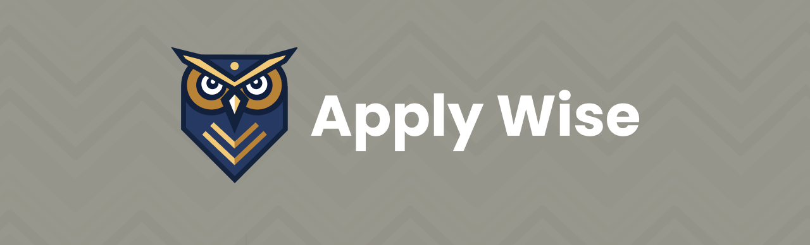

# Applywize: A RedwoodSDK Tutorial Project



## Overview

Applywize is a tutorial project designed to teach developers how to use RedwoodSDK. Applywize is a practical job application tracking system that helps job seekers organize their job search process, manage applications, and track contacts.

This tutorial follows the principle of "tutorial-driven development" - we've designed the developer experience first, then built the code to support it. By completing this tutorial, you'll learn all the core features of RedwoodSDK while building a modern, useful application.


## What You'll Build

Applywize is a full-stack application that includes:

- User authentication and account management
- Job application tracking with status updates
- Contact management for networking
- Modern UI with TailwindCSS and ShadCN components
- Database integration with Prisma
- Deployment to Cloudflare

## Repository Structure

```
.
├── README.md               # This file
├── assets/                 # Project assets and images for your application
├── end-of-2/               # Completed code after Lesson 2
├── end-of-3/               # Completed code after Lesson 3
├── end-of-4/               # Completed code after Lesson 4
├── end-of-5/               # Completed code after Lesson 5
├── end-of-6/               # Completed code after Lesson 6
├── end-of-7/               # Completed code after Lesson 7
├── end-of-8/               # Completed code after Lesson 8
├── end-of-9/               # Completed code after Lesson 9
├── figma/                  # Figma design file for reference
└── images-for-readme/      # Images used in this README
```

## Tutorial Structure

The tutorial is divided into 9 lessons:

### Lesson 1: Introduction

[ [DOCS](https://docs.rwsdk.com/tutorial/full-stack-app/setup) ]

- What we're building and why
- Final application preview
- Technical prerequisites
- Setting up your development environment

### Lesson 2: Creating Your Redwood Application

[ [DOCS](https://docs.rwsdk.com/tutorial/full-stack-app/create-app) ] | [ [CODE](./end-of-2/) ]

- Project generation and structure
- Understanding the new Redwood architecture
- Setting up TailwindCSS and ShadCN
- Running your first page

### Lesson 3: Database Setup

[ [DOCS](https://docs.rwsdk.com/tutorial/full-stack-app/database-setup) ] | [ [CODE](./end-of-3/) ]

- Designing our schema
- Creating migrations for jobs and contacts
- Understanding relationships between models
- Running migrations

### Lesson 4: Authentication Setup

[ [DOCS](https://docs.rwsdk.com/tutorial/full-stack-app/auth) ] | [ [CODE](./end-of-4/) ]

- Adding authentication
- Creating signup/login pages with ShadCN components
- Protecting routes
- Understanding the auth context

### Lesson 5: Jobs List Page

[ [DOCS](https://docs.rwsdk.com/tutorial/full-stack-app/jobs-list) ] | [ CODE ]

- Creating the main jobs page layout
- Building and styling the jobs table using ShadCN
- Implementing sorting and filtering
- Adding the "Create New Job" button

### Lesson 6: Job Forms

[ [DOCS](https://docs.rwsdk.com/tutorial/full-stack-app/jobs-form) ] | [ CODE ]

- Creating the new job form with ShadCN Form components
- Form validation
- Handling form submission
- Success/error states using ShadCN Toast

### Lesson 7: Contact Management

[ [DOCS](https://docs.rwsdk.com/tutorial/full-stack-app/contacts) ] | [ CODE ]

- Adding contacts interface
- Building the contact form with ShadCN components
- Displaying contacts in a responsive layout
- Editing and removing contacts

### Lesson 8: Job Details

[ [DOCS](https://docs.rwsdk.com/tutorial/full-stack-app/jobs-details) ] | [ CODE ]

- Building the job detail view
- Implementing edit functionality
- Adding delete capability with confirmation dialog
- Using ShadCN Dialog for confirmations

### Lesson 9: Deployment

[ [DOCS](https://docs.rwsdk.com/tutorial/full-stack-app/deploying) ] | [ CODE ]

- Preparing for production
- Deploying your application
- Next steps and additional resources

## How to Use This Repository

There are several ways to work through this tutorial:

1. **Follow along step-by-step**: Start from scratch and build the application as you progress through the tutorial.

2. **Use checkpoint references**: If you get stuck, refer to the `end-of-X` folders to see the completed code at the end of each lesson.

3. **Use the finished product**: The `end-of-9` folder contains the complete, finished application with all features implemented.

4. **Design reference**: The Figma files in the `figma` folder provide the complete UI design if you want to match the intended look and feel.

## Prerequisites

Before starting this tutorial, you should have:

- Basic knowledge of JavaScript, React, and modern web development
- Node.js and npm installed on your machine
- A code editor of your choice
- A Cloudflare account (for deployment)

## Getting Started

There are two ways to begin the tutorial:

### Option 1: Clone the entire repository

This will download all the files and folders to your computer.

```bash
git clone https://github.com/redwoodjs/applywize-tutorial.git
cd applywize-tutorial
```

### Option 2: Use degit to grab a specific lesson

If you want to start from a specific lesson or checkpoint, you can use [degit](https://github.com/Rich-Harris/degit) to grab just that folder:

```bash
# Get the code for a specific lesson (e.g., end of lesson 3)
npx degit redwoodjs/applywize-tutorial/end-of-3 my-applywize-app

# Navigate to your new project
cd my-applywize-app

# Install dependencies
pnpm install
```

This is particularly useful if you want to:

- Skip ahead to a specific part of the tutorial
- Start from a clean checkpoint if you ran into issues
- Compare your code with a working version

After setting up your project, follow the instructions in the tutorial documentation available at [docs.redwoodjs.com/tutorials/full-stack-app](https://docs.redwoodjs.com/tutorials/full-stack-app)

## Need Help?

If you encounter any issues while working through this tutorial:

- Check the relevant `end-of-X` folder to compare your code
- Visit the [RedwoodSDK Discussion](https://community.redwoodjs.com)
- Join the [RedwoodJS Discord](https://discord.gg/redwoodjs)

<!-- ## Additional Resources

After completing the main tutorial, check out these additional guides to enhance your application:

- Advanced UI Enhancements
- Document Management
- AI Integrations
- Testing & Quality Assurance
- External Integrations
- Advanced Authentication & Security -->

## License

This tutorial project is licensed under the MIT License - [see the LICENSE file for details](./LICENSE.md).
